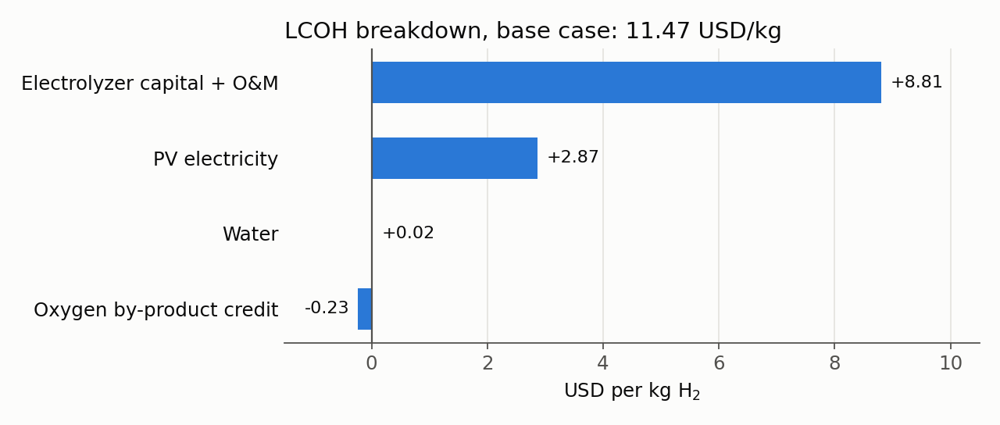
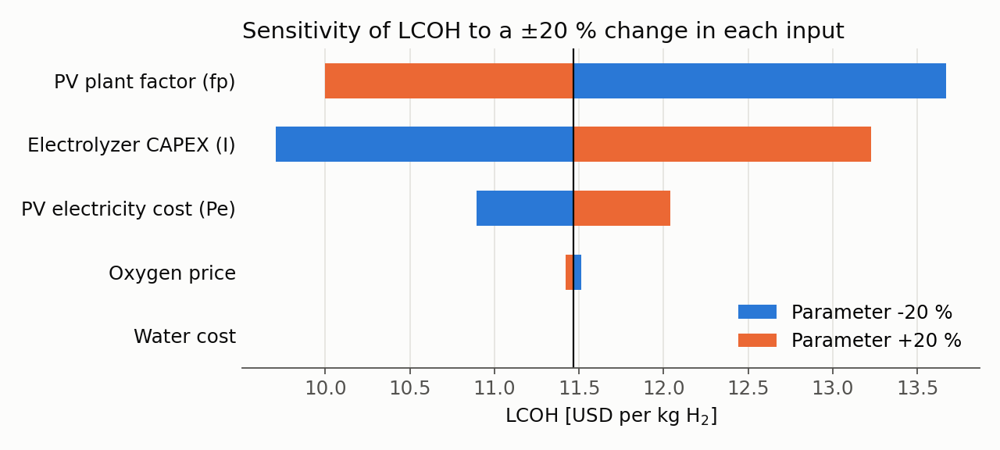
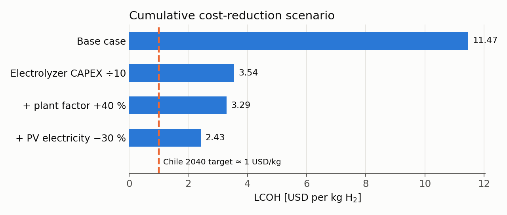

# ⚡ Green Hydrogen Cost Model: Solar PV Electrolysis in Chile

A Python implementation of the **Levelized Cost of Hydrogen (LCOH)** model from my undergraduate research project (PUC Chile IPre program, 2021, advised by Prof. Miguel Pérez de Arce). It estimates the cost of producing green hydrogen with **PEM electrolyzers powered by solar photovoltaic energy** in the **Atacama region**, and identifies which variables matter most to make it competitive.

<p align="center">
  
</p>

## 📐 Model

$$
LCOH = P_{inst}\cdot I \cdot \frac{FRC + M(f_p)}{h \cdot f_p \cdot Q_{H_2}} + Q_{H_2O} P_{H_2O} + Q_e P_e - Q_{O_2} P_{O_2}
$$

| Symbol | Meaning | Base value |
|---|---|---|
| $P_{inst}$ | Installed electrolyzer power | 1.25 MW |
| $I$ | Electrolyzer investment (high-investment scenario) | 1.5 MUSD/MW |
| $\frac{FRC + M(f_p)}{h \cdot f_p \cdot Q_{H_2}}$ | Capital recovery + maintenance, per unit of production | 4.6967 × 10⁻⁶ |
| $Q_{H_2O} P_{H_2O}$ | Water cost | 0.024 USD/kg |
| $Q_e P_e$ | PV electricity cost | 2.871 USD/kg |
| $Q_{O_2} P_{O_2}$ | Credit from selling by-product oxygen | 0.234 USD/kg |

Reference values come from the GIZ (2019) study *Tecnologías del hidrógeno y perspectivas para Chile* and data from Chile's Ministry of Energy for 2019 and 2020.

## 📊 Results

**Base case: ≈ 11.5 USD/kg**, far above the ~1 USD/kg that Chile's National Green Hydrogen Strategy targets for 2040. Electrolyzer capital cost is by far the largest component.

### Sensitivity analysis

Changing each input by ±20% shows that the **PV plant factor** and **electrolyzer CAPEX** dominate, followed by the **cost of PV electricity**. Water and oxygen barely matter.

<p align="center">
  
</p>

### Cost-reduction pathway

The report's conclusion proposed cutting electrolyzer CAPEX by up to 10×, raising the plant factor by 40% and lowering PV electricity cost by 30%. Applying those changes one after another:

<p align="center">
  
</p>

Cheaper electrolyzers produce the biggest single drop. Once CAPEX falls, **electricity becomes the dominant cost**, so reaching ~1 USD/kg also requires much cheaper solar power.

## ▶️ Run it

```bash
pip install -r requirements.txt
cd src
python run_analysis.py
```

This prints the base case, the sensitivity table and the scenario, and saves the figures to `figures/`.

```
src/
├── lcoh.py            # LCOH model, cost breakdown and sensitivity functions
└── run_analysis.py    # Reproduces all results and figures
docs/
└── IPRE-2021-green-hydrogen-report-ES.pdf   # Original research report (Spanish)
```

## 📝 Notes

- Plant factor enters the capital term as $1/f_p$; maintenance is kept proportional to the capital term (a simplification).
- Results are recomputed from the equations above, so some percentages differ slightly from the rounded values in the 2021 report.

## 🧰 Tools


